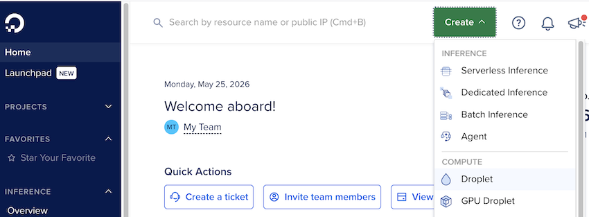

# 3. External Setup

This chapter will cover the external services and infrastructure the application depends on —
everything that must be provisioned *outside* the codebase before it can run in production:
- **Servers** — the DigitalOcean droplet(s) the app is deployed to,
  and the SSH keys Kamal uses to reach them.
- **Object storage** — the DigitalOcean Spaces bucket (`sailings-backup`) that holds the
  Litestream backups, and its access keys.
- **Email** — the Brevo account and API key used to send mail.
- **SMS** — the MobileMessage account used to send crew text messages.
- **Monitoring** — we use [UptimeRobot](https://uptimerobot.com/) to monitor the server every 5 minutes.

Each service maps to a key in the encrypted Rails credentials (`bin/rails credentials:edit`):
- `litestream`, `brevo`, `mobile_message`. This chapter will document how to obtain and
  configure each one.

Related detail already lives in [Deploying](30-deploying.md) (server creation and Kamal setup)
and [Backup & Restore](40-backup-restore.md) (the Spaces bucket and credentials).

## 3.1 Creating a server to deploy to

kamal can deploy to any server that supports Docker.  The recommended server is a dedicated VPS or cloud instance running Ubuntu 22.04 LTS.  I have deployed to DigitalOcean, Google Cloud Platform, and even a Raspberry Pi on my desk.

The recommended way to create is server is to use Digital Ocean's [Droplets](https://www.digitalocean.com/products/droplets/).  Login to DO's [control panel](https://cloud.digitalocean.com/) and create a new Droplet.



Select these options:

| Item           | Value                                             |
|----------------|---------------------------------------------------|
| Datacenter     | Sydney                                            |
| Image          | Ubuntu (recommended)                              |
| Droplet Plan   | Basic                                             |
| CPU Options    | Regular                                           |
| Select a Plan  | 1 vCPU / 2 GB RAM / 50 GB Disk - 1000 GB Transfer |
| Backups        | Enable if required, otherwise leave disabled      |
| Authentication | Select an existing SSH key, or **add a new one**      |
| Networking     | Enable IPv6                                       |
| Monitoring     | Enable                                            |
| Startup Script | Paste contents of bin/do-docker-map-volume        |
| Droplet Name   | Choose a better name                              |
| Project        | Choose what project to place it in                |

Click "Create Droplet" and wait a few minutes.  Note the Public IPv4 address of the machine.

Now we have a server running in the cloud with a public IP address to which we can login as root without a password so long as the public key on the server matches the private key on our local machine.

NOTE: if you prefer the command line to using the Digital Ocean control panel, install **doctl** (the Digital Ocean command line interface) on your development machine and run:

```
doctl compute droplet create sailings-clone \
  --region syd1 \
  --size s-1vcpu-2gb \
  --image ubuntu-24-04-x64 \
  --ssh-keys 96:02:5f:5c:d6:44:78:ab:1e:72:3d:ed:0e:1e:63:c8 \
  --enable-backups \
  --enable-monitoring \
  --enable-ipv6 \
  --user-data-file bin/docker-map-volume \
  --wait
```

Where sailings-clone is the name of the droplet, the ssh-keys value is the md5 hash of your public key (it's "fingerprint"), --enable-backups is optional (the sqlite3 database is separately backed up, see: [Backup & Restore](40-backup-restore.md)), --user-data-file is usefull to automatically configure the Docker map volume.  The other options are self-explanatory.

NOTE: It can take 2 minutes for the user-data-file to be applied.

You can fingerprint a public key with:
```bash
$ ssh-keygen -E md5 -l -f ~/.ssh/id*.pub
256 MD5:96:02:5f:5c:d6:44:78:ab:1e:72:3d:ed:0e:1e:63:c8 chris@MacBookPro.lan (ED25519)
```

NOTE: If you don't use DigitalOcean, you may need to ensure root can login via SSH. This may require you to add your public key to the root user's `~/.ssh/authorized_keys` file and to configure the SSH daemon to allow root login.  Root login is sometimes disabled by default.

## 3.2 Connecting to your server

Deploying a Rails app to a machine requires a ssh connection to the sever that **does not prompt** for a password.  This is one reason we use SSH keys rather than password access.

Note that developing with Rails on Windows effectively requires the use of WSL (Windows Subsystem for Linux), so working inside WSL, i.e. Linux, to generate the key pairs is the easiest way.  You can also use Putty on the Windows side if you know how.

If you don't already have an SSH Key, then generate one:

```
$ ssh-keygen
Generating public/private ed25519 key pair.
Enter file in which to save the key (/Users/chris/.ssh/id_ed25519): 
Enter passphrase for "id_ed25519" (empty for no passphrase):
Enter same passphrase again:
Your identification has been saved in id_ed25519
Your public key has been saved in id_ed25519.pub
```

Once you have a key, add it to the public key section of the droplet creation step.

### To add a new public key to an **existing server**:

To add your public key to an existing droplet, then connect to it somehow, probably with the "Web Console" button on the droplet's Overview page.  Then follow the instructions here:
https://docs.digitalocean.com/products/droplets/how-to/add-ssh-keys/to-existing-droplet/#manually
(The permissions of the files are probably fine if they already existed.)

## 3.3 Object storage

The Litestream continuously backs up your database to a cloud storage bucket.  On the DO dashboard, you can see the bucket and its contents.  Click on Storage in the sidebar, then Spaces Object Storage.  You will find the access keys in the rails credentials.yml file.

The backup bucket is named `sailings-backup` and is in a different region than the main database, currently in the `sfo` region.

## 3.4 Email

We use Brevo to accept emails and send on behalf of the Sailings app.  We use the Brevo API to send emails because DigitalOcean blocks SMTP (port 25, etc) access from droplets.  The Brevo API key is stored in the rails credentials.yml file.

The way to diagnose complaints about email delivery is to login to Brevo and check the Transactional -> Email -> Logs section.

## 3.5 SMS

The sailings rails app uses the [mobilemessanger.com.au API](https://mobilemessage.com.au/docs/api/) to send SMS messages.  The API key is stored in the rails credentials.yml file.

## 3.6 Monitoring

We use [UptimeRobot](https://uptimerobot.com/) to monitor the server every 5 minutes and send an email to report when the server is down.

[← Developing](10-developing.md) · [Manual index](README.md) · [Deploying →](30-deploying.md)
